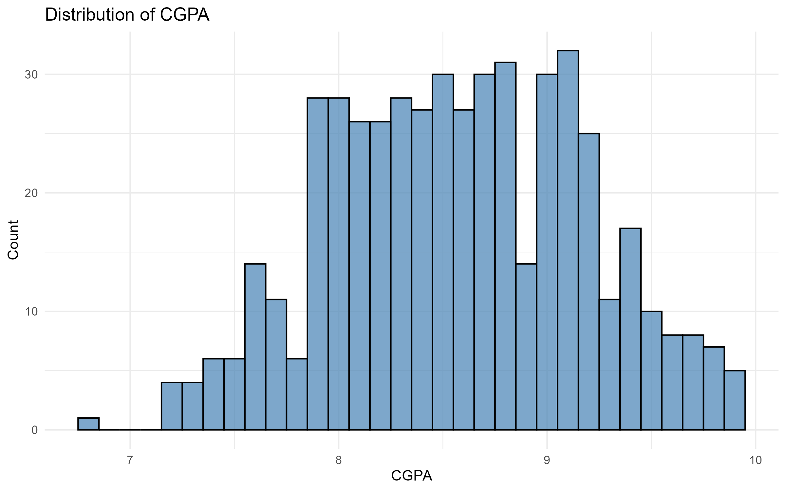
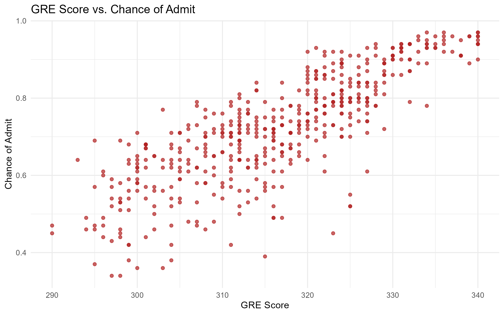
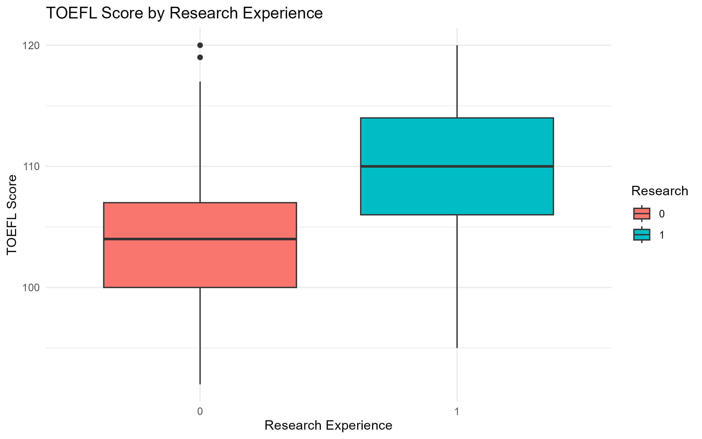
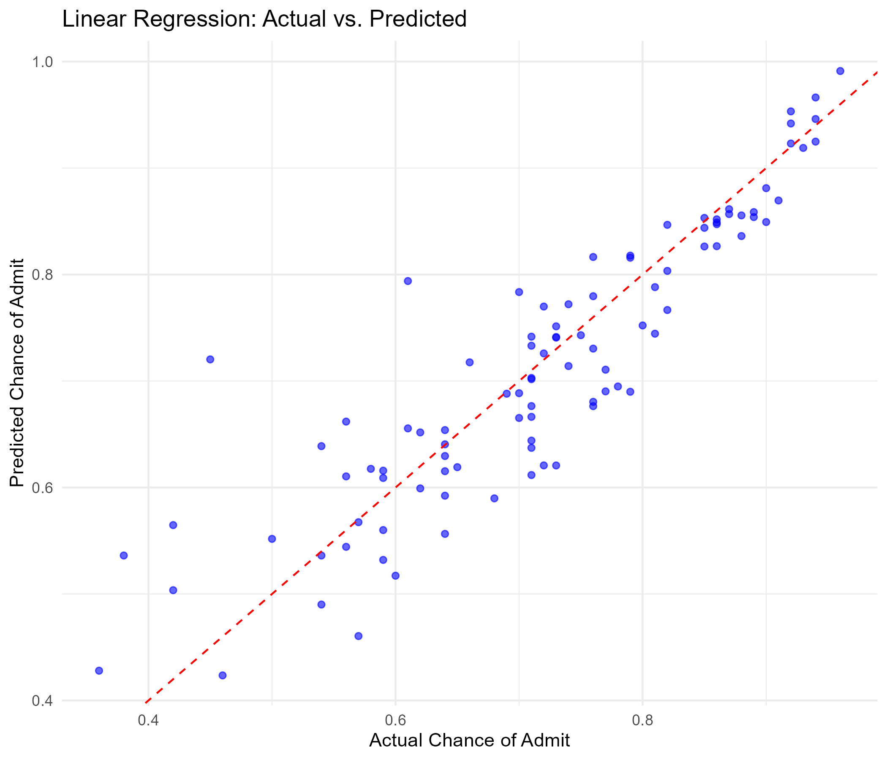
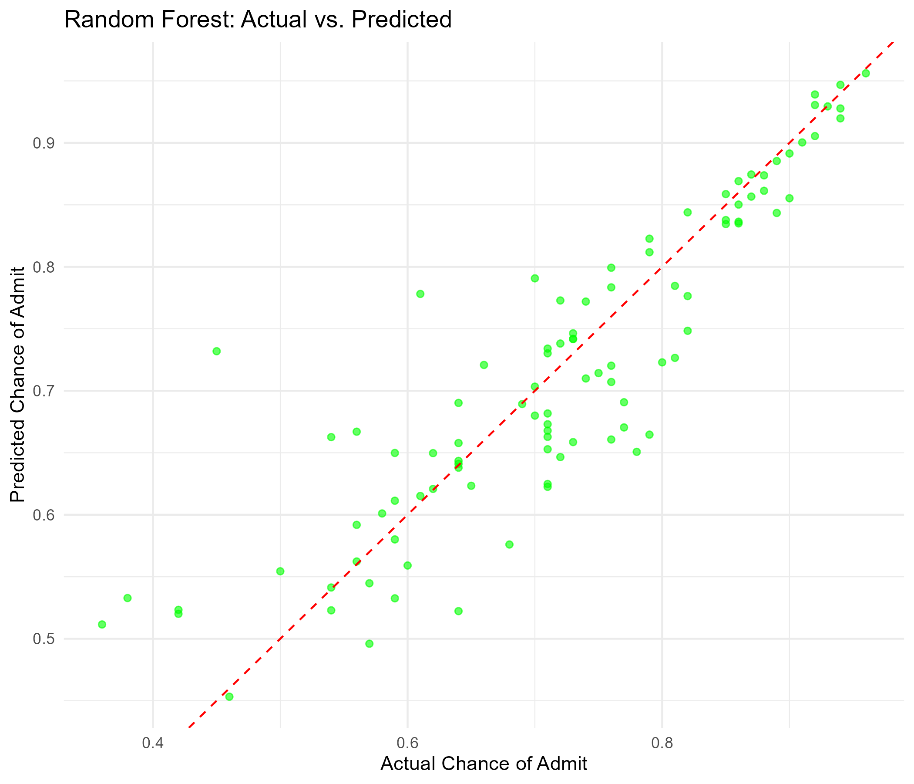

# College Admission Prediction Model

This repository presents a robust data analysis pipeline to predict a student's probability of admission to a graduate program. The project leverages a comprehensive dataset of applicant profiles and compares two regression models—Linear Regression and Random Forest—to determine the most effective predictive approach.

## 🚀 Project Highlights

* **Comprehensive EDA:** In-depth exploratory data analysis reveals key relationships between applicant scores and admission chances.
* **Dual-Model Implementation:** Builds and evaluates both a classic Linear Regression model for interpretability and a powerful Random Forest model for predictive accuracy.
* **Quantitative Evaluation:** Models are rigorously assessed using RMSE, R-squared, and MAE metrics on a dedicated test set.
* **Interactive Application:** Includes a standalone Shiny app (`app.R`) for real-time admission predictions based on user-provided inputs.

---
## 📈 Analysis and Model Performance

The analysis confirms that applicant metrics such as CGPA, GRE Score, and TOEFL Score are strong predictors of admission chance.

### Key Visualizations

| CGPA Distribution | GRE Score vs. Admission Chance | TOEFL Score by Research |
| :---: | :---: | :---: |
|  |  |  |

### Model Diagnostics

The plots below compare each model's predicted values against the actual values. The Random Forest model's predictions cluster more tightly around the ideal diagonal line, indicating superior performance.

| Linear Regression (Actual vs. Predicted) | Random Forest (Actual vs. Predicted) |
| :---: | :---: |
|  |  |

---
## 🏆 Final Results & Recommendation

The Random Forest model consistently outperformed Linear Regression, demonstrating a lower Root Mean Squared Error (RMSE) and a higher R-squared value.

| Model | RMSE | R-squared | MAE |
| :--- | :--- | :--- | :--- |
| Linear Regression | 0.0632 | 0.8143 | 0.0451 |
| **Random Forest** | **0.0594** | **0.8354** | **0.0415** |

**Conclusion:** Due to its superior predictive accuracy, the **Random Forest model** is the recommended solution for this prediction task.

---
## ⚙️ Usage

To run this project locally:

1.  Clone the repository:
    ```bash
    git clone https://github.com/BANDARI2111/college-admission-prediction-R.git
    ```
2.  Open the project in RStudio.
3.  Install the required libraries:
    ```R
    install.packages(c("tidyverse", "caret", "randomForest", "shiny"))
    ```
4.  To run the full analysis and generate plots, execute the `analysis.R` script.
5.  To launch the interactive prediction tool, execute the `app.R` script.
